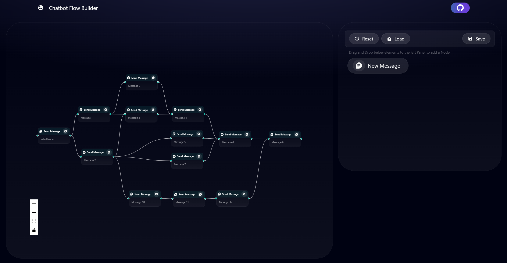

This is a flow chart builder for chatbots made with Typescript and NextJS.

## Demo Link

[Live Demo](https://chatbot-flow-builder-iota.vercel.app/)

## Features

- Editable Nodes with Messages
- Drag and Drop New Messages
- Delete a Node with “Backspace” Button in Keyboard
- Edge connectivity to other Nodes
- Workflow Reset Functionality
- Save and Load Functionality
- Error Handling while Save and Reset.
- Fully build using NextJS and Typescript with the help of React-Flow.

## Plugin Walkthrough/Demonstration

https://drive.google.com/file/d/1P3ig_3cI84ckbICvivF-dFCO_ckV2Wrf/view?usp=sharing

### Dev Requirements

- [Node.js](https://nodejs.org/en) 16 or later

---

## Quick Start Guide for Developers

`git clone [repository]`

- Clone the repository

`cd [directory]`

- CD into Directory

`npm install`

- Installs all dependencies

`npm run dev`

- Runs in dev mode.
- Viewable in browser via localhost:3000/

---

## Config and Code Structure

Typescript or application code in `app/`directory.
